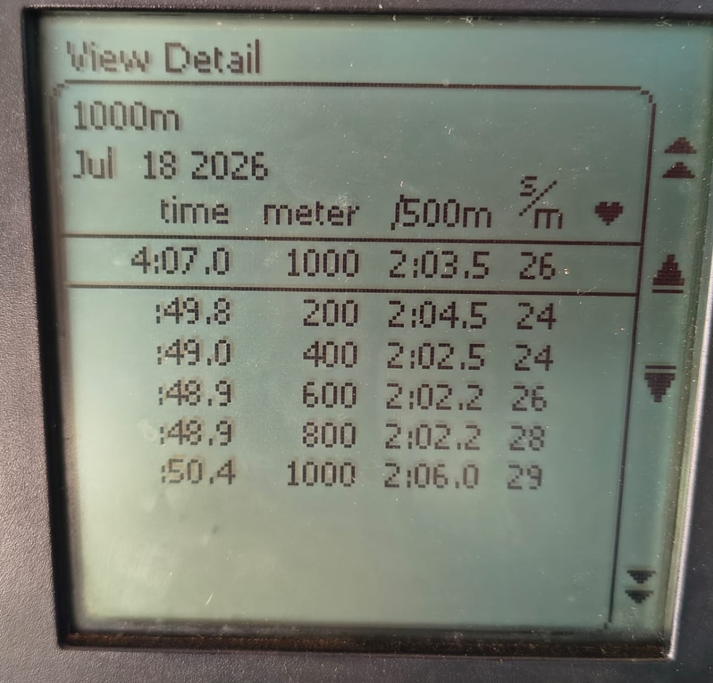
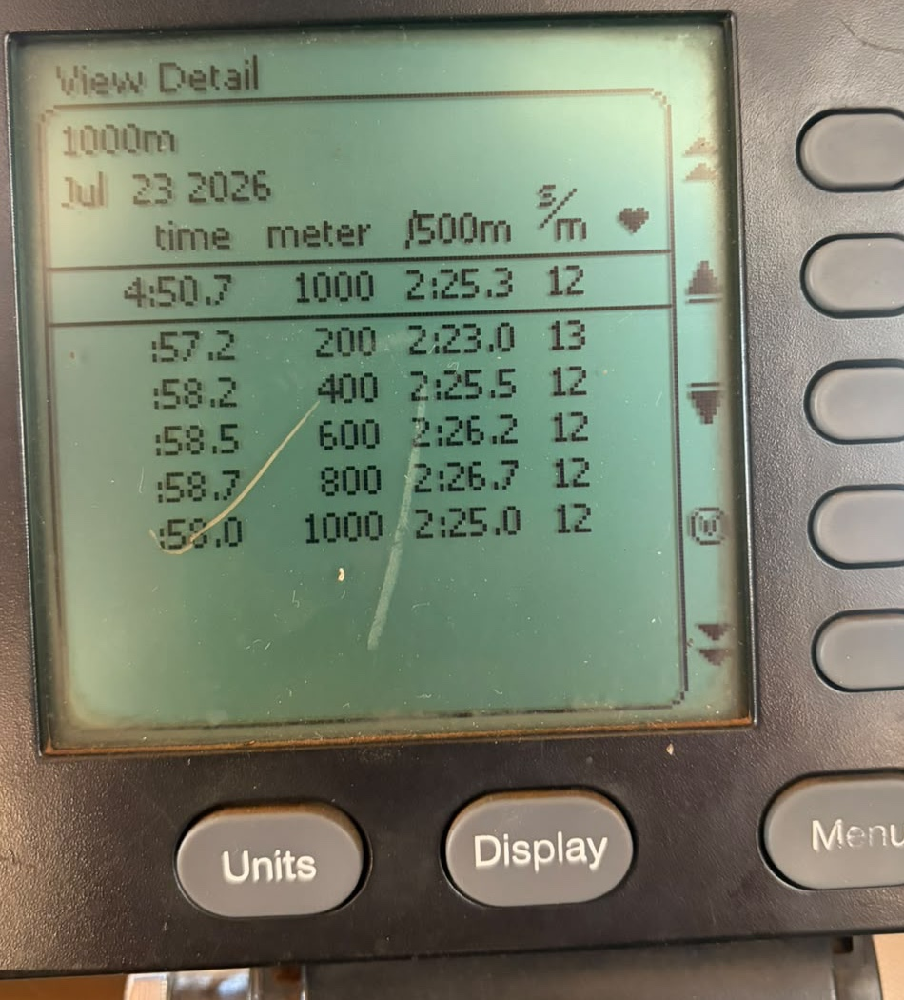
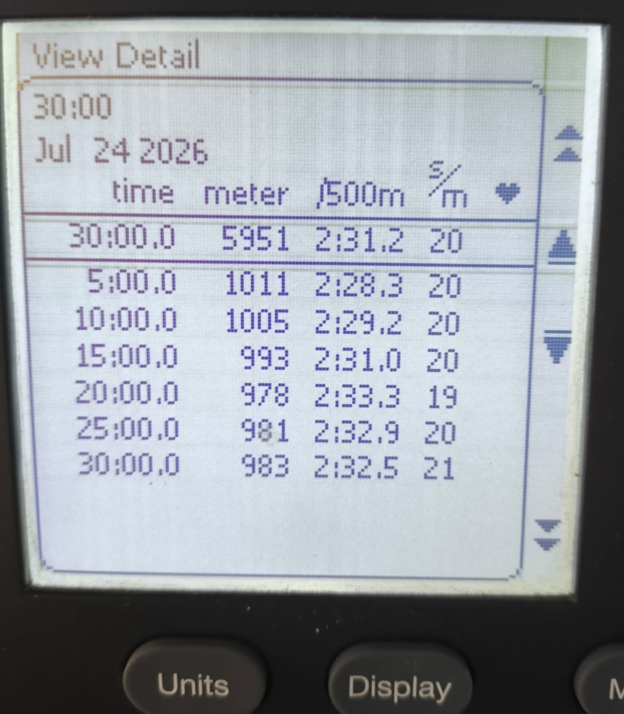
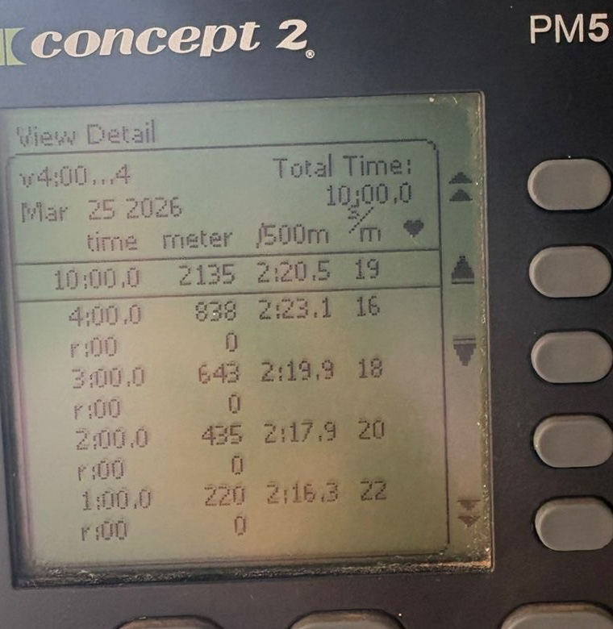

# Concept2 PM5 real-reference packet

**Classification:** `ANONYMIZED_REAL_REFERENCE`

These minimized crops were derived from original Concept2 PM5 photographs
supplied by the project owner for the hackathon. They give judges direct visual
evidence for the screen shapes that informed WAKE's Concept2 transcription
adapter. They are not synthetic screenshots, but they are also not evaluation
fixtures and were not sent to an agent.

No athlete identity, face, location, device serial, GPS route, or file metadata
is retained. Dates and anonymous performance values remain visible because they
are necessary to demonstrate the source format. Heart-rate-bearing reference
material remains private and is not included in this public packet.

The adjacent CSV files are human-confirmed transcriptions of the visible PM5
rows. Automatic image OCR is not implemented. Native ErgData or Concept2 export
ingestion is also not claimed. WAKE normalizes these confirmed values
deterministically and preserves the distinction between:

- fixed-distance screens: cumulative distance plus per-split time;
- fixed-time screens: cumulative time plus per-split distance;
- interval screens: individual work or recovery rows.

## Fixed distance: 1,000 m

The `meter` column is cumulative (`200, 400, ... 1000`) while each displayed
time is the duration of that 200 m split. The confirmed transcription is
[`fixed-distance-1000m.csv`](transcriptions/fixed-distance-1000m.csv).

## Fixed distance at low stroke rate

This reference demonstrates why SPM alone is not a performance conclusion. The
same screen shape can contain a materially different pace and rate combination;
athlete identity and plan intent are not available. The confirmed transcription
is [`fixed-distance-low-rate.csv`](transcriptions/fixed-distance-low-rate.csv).

## Fixed time: 30 minutes

Here the `time` column is cumulative (`5:00, 10:00, ... 30:00`) and `meter`
contains the distance of each five-minute split. The confirmed transcription is
[`fixed-time-30min.csv`](transcriptions/fixed-time-30min.csv).

## Variable work intervals

The visible work rows follow a 4–3–2–1 minute ladder. Recovery duration is not
legible enough to confirm, so it is omitted rather than inferred. The confirmed
work-only transcription is
[`interval-ladder-work-only.csv`](transcriptions/interval-ladder-work-only.csv).

An additional fixed-time transcription,
[`fixed-time-30min-fast.csv`](transcriptions/fixed-time-30min-fast.csv), preserves
a second anonymous PM5 example without publishing another near-identical crop.

## Public-use boundary

These references support the claim that WAKE's format and plausible value
ranges were grounded in supplied rowing material. They do not establish who
performed a workout, what was prescribed, why a metric changed, whether visible
technique was correct, or that WAKE improved athletic performance.
